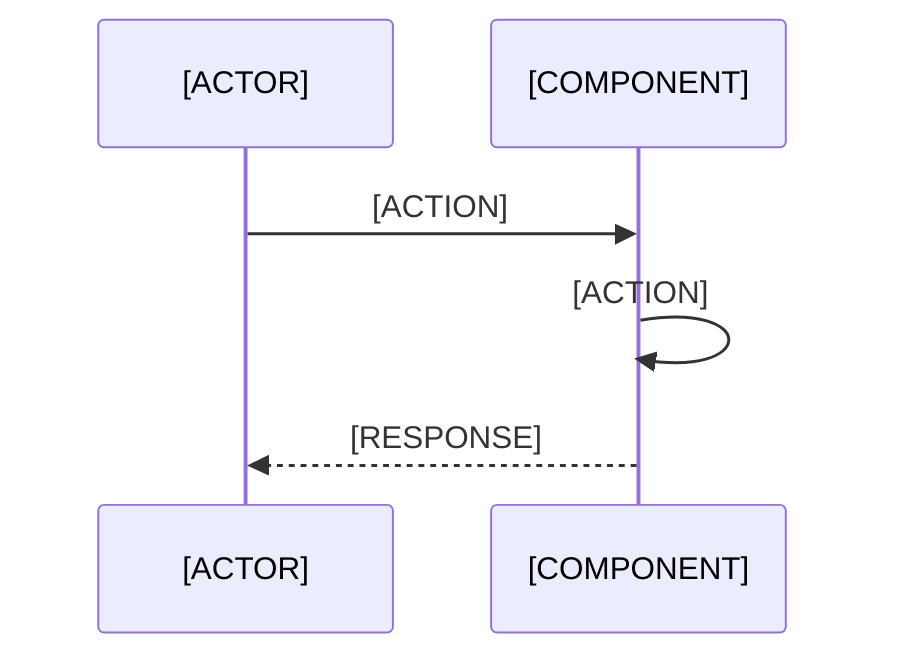

# Implementation Plan: [FEATURE]

**Branch**: `[###-feature-name]` | **Date**: [DATE] | **Spec**: [link]
**Input**: Feature specification from `/specs/[###-feature-name]/spec.md`

**Note**: This template is filled in by the `/speckit.plan` command. See `.specify/templates/plan-template.md` for the execution workflow.

## Summary

[Extract from feature spec: primary requirement + technical approach from research]

## Technical Context

<!--
  ACTION REQUIRED: Replace the content in this section with the technical details
  for the project. The structure here is presented in advisory capacity to guide
  the iteration process.
-->

**Language/Version**: [e.g., Python 3.11, Swift 5.9, Rust 1.75 or NEEDS CLARIFICATION]  
**Primary Dependencies**: [e.g., FastAPI, UIKit, LLVM or NEEDS CLARIFICATION]  
**Storage**: [if applicable, e.g., PostgreSQL, CoreData, files or N/A]  
**Testing**: [e.g., pytest, XCTest, cargo test or NEEDS CLARIFICATION]  
**Target Platform**: [e.g., Linux server, iOS 15+, WASM or NEEDS CLARIFICATION]
**Project Type**: [e.g., library/cli/web-service/mobile-app/compiler/desktop-app or NEEDS CLARIFICATION]  
**Performance Goals**: [domain-specific, e.g., 1000 req/s, 10k lines/sec, 60 fps or NEEDS CLARIFICATION]  
**Constraints**: [domain-specific, e.g., <200ms p95, <100MB memory, offline-capable or NEEDS CLARIFICATION]  
**Scale/Scope**: [domain-specific, e.g., 10k users, 1M LOC, 50 screens or NEEDS CLARIFICATION]

## Constitution Check

*GATE: Must pass before Phase 0 research. Re-check after Phase 1 design.*

[Gates determined based on constitution file]

## Project Structure

### Documentation (this feature)

```text
specs/[###-feature]/
├── plan.md              # This file (/speckit.plan command output)
├── research.md          # Phase 0 output (/speckit.plan command)
├── data-model.md        # Phase 1 output (/speckit.plan command)
├── quickstart.md        # Phase 1 output (/speckit.plan command)
├── contracts/           # Phase 1 output (/speckit.plan command)
└── tasks.md             # Phase 2 output (/speckit.tasks command - NOT created by /speckit.plan)
```

### Source Code (repository root)
<!--
  ACTION REQUIRED: Replace the placeholder tree below with the concrete layout
  for this feature. Delete unused options and expand the chosen structure with
  real paths (e.g., apps/admin, packages/something). The delivered plan must
  not include Option labels.
-->

```text
# [REMOVE IF UNUSED] Option 1: Single project (DEFAULT)
src/
├── models/
├── services/
├── cli/
└── lib/

tests/
├── contract/
├── integration/
└── unit/

# [REMOVE IF UNUSED] Option 2: Web application (when "frontend" + "backend" detected)
backend/
├── src/
│   ├── models/
│   ├── services/
│   └── api/
└── tests/

frontend/
├── src/
│   ├── components/
│   ├── pages/
│   └── services/
└── tests/

# [REMOVE IF UNUSED] Option 3: Mobile + API (when "iOS/Android" detected)
api/
└── [same as backend above]

ios/ or android/
└── [platform-specific structure: feature modules, UI flows, platform tests]
```

**Structure Decision**: [Document the selected structure and reference the real
directories captured above]

## Complexity Tracking

> **Fill ONLY if Constitution Check has violations that must be justified**

| Violation | Why Needed | Simpler Alternative Rejected Because |
|-----------|------------|-------------------------------------|
| [e.g., 4th project] | [current need] | [why 3 projects insufficient] |
| [e.g., Repository pattern] | [specific problem] | [why direct DB access insufficient] |

## API Impact

| Endpoint | Method | Change Type | Description |
|-----------|--------|-------------|-------------|
| [e.g., /api/users] | GET | [New/Modified/Removed] | [Purpose] |
| [e.g., /api/users/:id] | POST | [New/Modified/Removed] | [Purpose] |

## Tables Impact

| Table | Change Type | Columns Affected | Description |
|-------|------------|-----------------|-------------|
| [e.g., users] | [New/Modified/Removed] | [email, password_hash] | [Purpose] |
| [e.g., sessions] | [New/Modified/Removed] | [user_id, token] | [Purpose] |

## Diagrams

### Sequence Diagram

<!--
  ACTION REQUIRED: Create a sequence diagram showing the flow of interactions
  between system components/actors for the primary use case.

  Use Mermaid syntax for rendering:
  ```mermaid
  sequenceDiagram
    participant User
    participant Frontend
    participant API
    participant Database
    User->>Frontend: Action
    Frontend->>API: Request
    API->>Database: Query
    Database-->>API: Response
    API-->>Frontend: Result
    Frontend-->>User: Updated UI
  ```
-->



### Component Diagram

<!--
  ACTION REQUIRED: Show the high-level architecture and relationships
  between system components.

  ```mermaid
  componentDiagram
    component Frontend {
      [UI Components]
    }
    component API {
      [Handlers]
      [Services]
    }
    component Database {
      [Tables]
    }
    Frontend --> API
    API --> Database
  ```
-->

```mermaid
componentDiagram
    component [COMPONENT_A] {
      [SUB_COMPONENTS]
    }
    component [COMPONENT_B] {
      [SUB_COMPONENTS]
    }
    [COMPONENT_A] --> [COMPONENT_B]
```

### ERD (Database Changes)

<!--
  ACTION REQUIRED: If the feature involves database changes, create an ERD
  showing entity relationships.

  Only include if spec.md mentions: database, storage, model changes, migrations

  ```mermaid
  erDiagram
    USER ||--o{ POST : writes
    POST ||--o{ COMMENT : has
    USER {
      string id
      string email
      timestamp created_at
    }
    POST {
      string id
      string title
      text content
      string user_id
      timestamp created_at
    }
    COMMENT {
      string id
      text content
      string post_id
      string user_id
      timestamp created_at
    }
  ```
-->

```mermaid
erDiagram
    [ENTITY_A] ||--o{ [ENTITY_B] : [RELATIONSHIP]
    [ENTITY_A] {
      [FIELDS]
    }
    [ENTITY_B] {
      [FIELDS]
    }
```

### Use Case Diagram

<!--
  ACTION REQUIRED: Show the actors and their interactions with the system.

  ```mermaid
  useCaseDiagram
    actor User
    actor Admin
    rectangle System {
      usecase Login
      usecase ViewData
      usecase ManageData
    }
    User --> Login
    User --> ViewData
    Admin --> ViewData
    Admin --> ManageData
  ```
-->

```mermaid
useCaseDiagram
    actor [ACTOR]
    rectangle System {
      usecase [USE_CASE_1]
      usecase [USE_CASE_2]
    }
    [ACTOR] --> [USE_CASE_1]
    [ACTOR] --> [USE_CASE_2]
```
