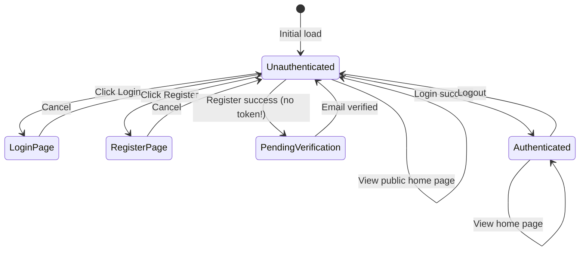

# Data Model: Home Page Authentication

## Frontend Types

```typescript
// User entity (from API)
interface User {
  id: string;
  username: string;
  email: string;
  created_at: string;
}

// Login request
interface LoginRequest {
  identifier: string;  // username or email
  password: string;
}

// Register request
interface RegisterRequest {
  username: string;
  email: string;
  password: string;
}

// Verify email request
interface VerifyRequest {
  token: string;
}

// Login response (success)
interface LoginResponse {
  token: string;
  expires_at: string;
  user: User;
}

// Register response (success)
interface RegisterResponse {
  message: string;
  user_id: string;
}

// Verify response (success)
interface VerifyResponse {
  message: string;
}

// Logout response (success)
interface LogoutResponse {
  message: string;
}

// API error response
interface ApiError {
  error_code: string;
  message: string;
}

// Form validation errors
interface ValidationErrors {
  [field: string]: string;
}
```

## Component Props

```typescript
// PublicHomePage
interface PublicHomePageProps {}

// AuthenticatedHomePage
interface AuthenticatedHomePageProps {}

// LoginPage
interface LoginPageProps {}

// RegisterPage
interface RegisterPageProps {}

// AuthForm (shared)
interface AuthFormProps {
  mode: 'login' | 'register';
  onSubmit: (data: LoginRequest | RegisterRequest) => void;
  isLoading: boolean;
  error: string | null;
}

// Button
interface ButtonProps {
  children: React.ReactNode;
  variant?: 'primary' | 'secondary';
  type?: 'button' | 'submit';
  disabled?: boolean;
  onClick?: () => void;
}

// Greeting
interface GreetingProps {
  username?: string;
  isAuthenticated: boolean;
}
```

## State Transitions



## Data Flow

1. **User loads app** → Check localStorage for token → If token exists, call `/me` → Set AuthContext state
2. **User registers** → POST to `/register` → Show "check email" message (no auto-login)
3. **User verifies email** → Click link with token → POST to `/verify` → Show success → Redirect to login
4. **User logs in** → POST credentials to `/login` → Store token in localStorage → Update AuthContext → Navigate to authenticated home
5. **User logs out** → POST to `/logout` → Clear localStorage → Reset AuthContext → Navigate to public home

## Email Verification Flow

```
Register → Email sent with verification link → Click link → Verify → Login
```

> **Important**: Registration does NOT grant immediate access. Users must verify their email before logging in.