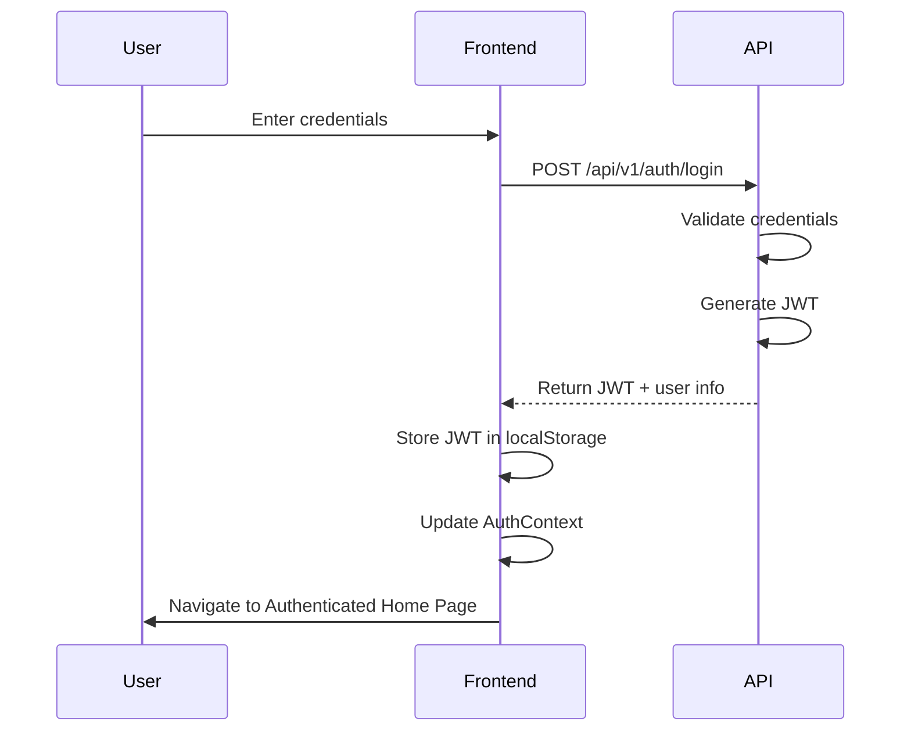
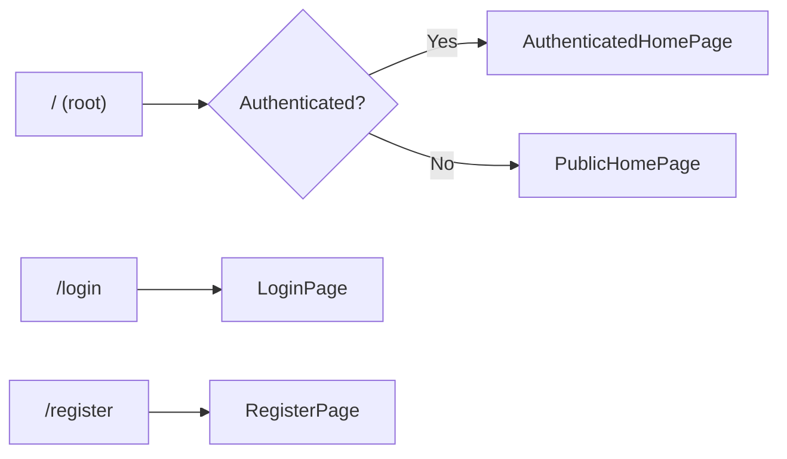

# Implementation Plan: Home Page Authentication

**Branch**: `001-home-page` | **Date**: 2026-04-26 | **Spec**: [spec.md](./spec.md)
**Input**: Feature specification from `/specs/001-home-page/spec.md`

## Summary

Create a React/TypeScript frontend with public home page, login page, register page, and authenticated home page. The application greets users and provides navigation between authentication pages based on session state.

## Technical Context

**Language/Version**: TypeScript 5.x
**Primary Dependencies**: React 18+, React Router v6+, React Hook Form, Zod, Vite, Tailwind CSS, Vitest, React Testing Library
**Storage**: Local storage for JWT token, React Context for auth state
**Testing**: Vitest with React Testing Library
**Target Platform**: Web browser
**Performance Goals**: Page navigation < 1s, login/register completion < 30s
**Constraints**: Must be accessible (WCAG 2.1 AA), responsive (mobile/tablet/desktop)
**Scale/Scope**: Frontend authentication UI, backend API integration via REST

## Constitution Check

*GATE: Must pass before Phase 0 research. Re-check after Phase 1 design.*

| Principle | Requirement | Status |
|-----------|-------------|--------|
| Code Quality Discipline | TypeScript strict mode, ESLint/Prettier pass | Pass |
| Code Quality Discipline | Functional components with hooks | Pass |
| Code Quality Discipline | JSDoc comments for components | Pass |
| Frontend Service Requirements | Accessibility (WCAG 2.1 AA) | Pass |
| Frontend Service Requirements | Responsive design | Pass |
| Frontend Service Requirements | Error boundaries | Pass |
| User Experience Consistency | Loading/error/success states | Pass |
| User Experience Consistency | React Router v6 for routing | Pass |

## Project Structure

### Documentation (this feature)

```text
specs/001-home-page/
├── plan.md              # This file
├── research.md          # Phase 0 output
├── data-model.md        # Phase 1 output
├── quickstart.md        # Phase 1 output
├── contracts/           # Phase 1 output (API contracts)
└── tasks.md             # Phase 2 output
```

### Source Code

```text
budget-fe/src/
├── main.tsx
├── App.tsx
├── pages/
│   ├── PublicHomePage.tsx
│   ├── AuthenticatedHomePage.tsx
│   ├── LoginPage.tsx
│   └── RegisterPage.tsx
├── components/
│   ├── Greeting.tsx
│   ├── AuthForm.tsx
│   ├── Button.tsx
│   └── ErrorBoundary.tsx
├── context/
│   └── AuthContext.tsx
├── hooks/
│   ├── useAuth.ts
│   └── useFormValidation.ts
├── services/
│   └── api.ts
├── types/
│   └── auth.ts
└── styles/
    └── index.css
```

**Structure Decision**: Frontend feature implemented in `budget-fe/` submodule. Backend (`budget-be/`) already exists and provides auth API endpoints.

## API Impact

| Endpoint | Method | Change Type | Description |
|----------|--------|-------------|-------------|
| /api/v1/auth/login | POST | Existing | User authentication (identifier + password) |
| /api/v1/auth/register | POST | Existing | User registration (username, email, password) |
| /api/v1/auth/logout | POST | Existing | Session termination |
| /api/v1/auth/me | GET | Existing | Get current user info |

> **Note**: Email verification (`/api/v1/auth/verify`) is out of scope for this feature.

## Tables Impact

| Table | Change Type | Columns Affected | Description |
|-------|------------|-----------------|-------------|
| users | None | N/A | Existing table, no changes |
| sessions | None | N/A | Handled via JWT |

## Diagrams

### Sequence Diagram: Login Flow



### Component Diagram

```mermaid
componentDiagram
    component PublicHomePage {
        Greeting
        Button (Login)
        Button (Register)
    }
    component LoginPage {
        AuthForm (identifier, password)
        ErrorMessage
        Link (Register)
    }
    component RegisterPage {
        AuthForm (username, email, password)
        ErrorMessage
        Link (Login)
    }
    component AuthenticatedHomePage {
        PersonalizedGreeting
        NavigationLinks
        LogoutButton
    }
    component AuthContext {
        user state
        login()
        logout()
        isAuthenticated
    }
    PublicHomePage --> AuthContext
    LoginPage --> AuthContext
    RegisterPage --> AuthContext
    AuthenticatedHomePage --> AuthContext
```

### Use Case Diagram

```mermaid
useCaseDiagram
    actor UnauthenticatedUser
    actor AuthenticatedUser
    rectangle Frontend {
        usecase ViewPublicHomePage
        usecase Login
        usecase Register
        usecase ViewAuthenticatedHomePage
        usecase Logout
    }
    UnauthenticatedUser --> ViewPublicHomePage
    UnauthenticatedUser --> Login
    UnauthenticatedUser --> Register
    AuthenticatedUser --> ViewAuthenticatedHomePage
    AuthenticatedUser --> Logout
```

### Routing Structure



## Research Phase

### Out of Scope

- Email verification flow (separate feature journey)

### Authentication Patterns

**Decision**: Use JWT stored in localStorage with React Context for state management

**Rationale**:
- JWT is stateless and scales well
- React Context provides global auth state without prop drilling
- localStorage persists session across page refreshes

**Alternatives considered**:
- Session cookies: Requires backend changes, less REST-friendly
- Server-side rendering: More complex, not needed for this SPA

### Form Validation

**Decision**: React Hook Form + Zod

**Rationale**:
- Declarative validation schemas
- Integrates well with TypeScript
- Used in project's technology stack

**Alternatives considered**:
- Built-in HTML validation: Limited, not type-safe
- Yup: Similar to Zod, but Zod is more modern

### Protected Routes

**Decision**: React Router v6 wrapper component

**Rationale**:
- Standard pattern for React Router v6
- Easy to compose with existing routes

**Alternatives considered**:
- Middleware: Overkill for SPA
- HOC: More complex, less readable