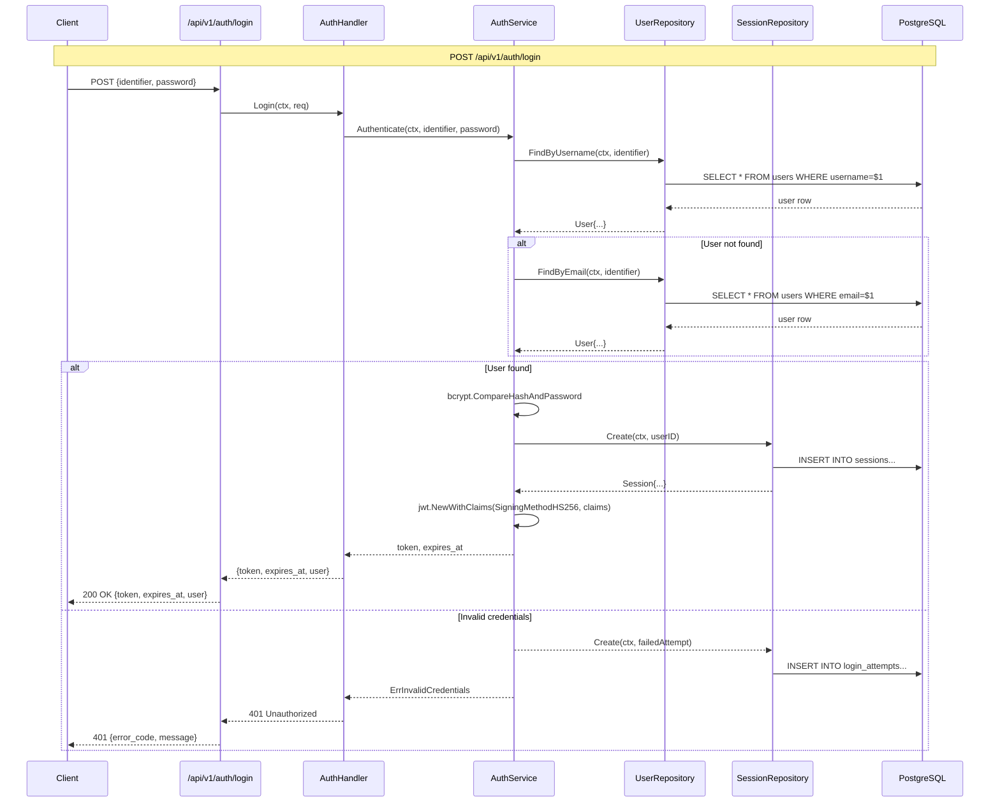
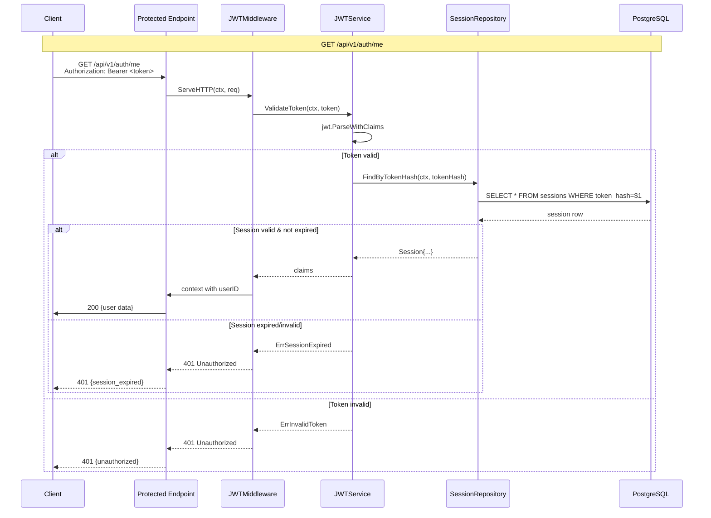
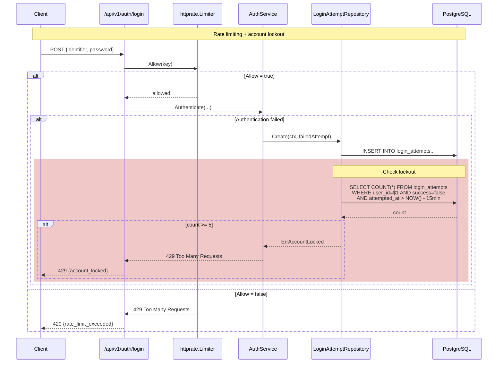

# Implementation Plan: User Login with Basic Authentication

**Branch**: `001-user-login` | **Date**: 2026-04-25 | **Spec**: specs/001-user-login/spec.md
**Input**: Feature specification from `/specs/001-user-login/spec.md`

**Note**: This template is filled in by the `/speckit.plan` command. See `.specify/templates/plan-template.md` for the execution workflow.

## Summary

Implement a REST API authentication service for the Budget application that allows users to log in using either username or email with password-based authentication. Returns JWT session tokens with 24-hour expiry, enforces rate limiting and account lockout after failed attempts, and stores passwords securely using bcrypt (cost ≥12).

## Technical Context

**Language/Version**: Go 1.21+ (from Constitution)
**Primary Dependencies**: pgx (PostgreSQL), golang-jwt/jwt/v5, golang.org/x/crypto/bcrypt, github.com/google/uuid, go-chi/httprate (rate limiting)
**Storage**: PostgreSQL (budget database)
**Testing**: Go standard testing package with `-cover` flag
**Target Platform**: Linux server (container/VM)
**Project Type**: REST API web-service
**Performance Goals**: Login response ≤200ms p95 latency
**Constraints**: Security-first (no password logging, timing-safe comparison, rate limiting)
**Scale/Scope**: Single service handling authentication for Budget API users

## Constitution Check

*GATE: Must pass before Phase 0 research. Re-check after Phase 1 design.*

| Gate | Status | Notes |
|------|--------|-------|
| Testing Required (TDD) | **PASS** | Must write tests before implementation per Constitution III |
| Code Quality (gofmt/golangci-lint) | **PASS** | All code must pass linting per Constitution I |
| PostgreSQL (system-of-record) | **PASS** | Uses PostgreSQL per Constitution Technology Stack |
| Password Hashing (bcrypt cost ≥12) | **PASS** | Already in spec requirements |
| 80% Test Coverage | **PASS** | Required per Constitution III |
| Financial Data Principles | **PASS** | N/A for auth feature (no financial data) |

### Phase 0: Research

**Research Questions Identified:**

| Question | Source | Status |
|----------|--------|--------|
| What JWT library to use for Go? | Technical Context | **RESOLVED** - golang-jwt/jwt/v5 |
| Best practices for JWT in Go authentication | Feature spec requirements | **RESOLVED** |
| Rate limiting implementation patterns for Go | Spec FR-011 | **RESOLVED** - go-chi/httprate |
| Best practices for session/token management in REST APIs | Spec assumptions | **RESOLVED** |

**Resolution notes will be documented in research.md**

## Project Structure

### Documentation (this feature)

```text
specs/001-user-login/
├── plan.md              # This file
├── research.md          # Phase 0 output
├── data-model.md        # Phase 1 output
├── quickstart.md        # Phase 1 output
├── contracts/           # Phase 1 output
└── tasks.md             # NOT created by /speckit.plan
```

### Source Code (repository root)

```text
internal/
├── config/
├── auth/
│   ├── handler.go       # HTTP handlers
│   ├── service.go      # business logic
│   ├── middleware.go   # auth middleware
│   └── model.go        # domain models
├── user/
│   ├── repository.go  # user data access
│   └── model.go       # user entity
├── session/
│   ├── repository.go  # session data access
│   └── model.go       # session entity
├── loginattempt/
│   ├── repository.go  # login attempt tracking
│   └── model.go        # login attempt entity
└── db/
    └── pool.go        # database connection

migrations/
└── auth/
    └── *.sql          # schema migrations

api/
└── v1/
    └── auth/
        └── *.go       # HTTP route handlers

cmd/
└── api/
    └── main.go        # entry point

tests/
├── unit/
├── integration/
└── contract/
```

**Structure Decision**: Single Go service (`internal/auth`) as authentication module within Budget API. Follows Go project conventions per Constitution. Database migrations separate from code. API handlers in `api/v1/` following REST conventions.

## Sequence Diagrams

### Login Flow (US1 - Successful Login)



### Authentication Middleware Flow



### Rate Limiting & Account Lockout Flow



## Component Interactions

| Component | Responsibility | Public API |
|-----------|--------------|------------|
| AuthHandler | HTTP request/response | Login, Me, Logout |
| AuthService | Authentication logic | Authenticate, GenerateToken, ValidateToken |
| UserRepository | User data access | FindByUsername, FindByEmail |
| SessionRepository | Session management | Create, FindByTokenHash, Invalidate |
| LoginAttemptRepository | Attempt tracking | Create, CountRecent |
| JWTMiddleware | Token validation | ServeHTTP |
