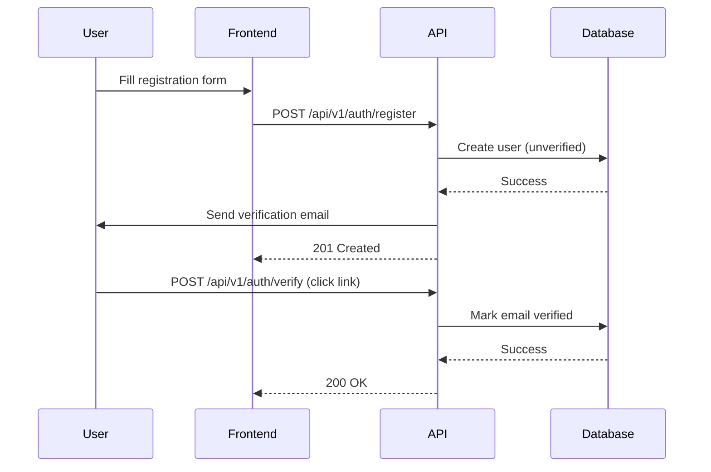
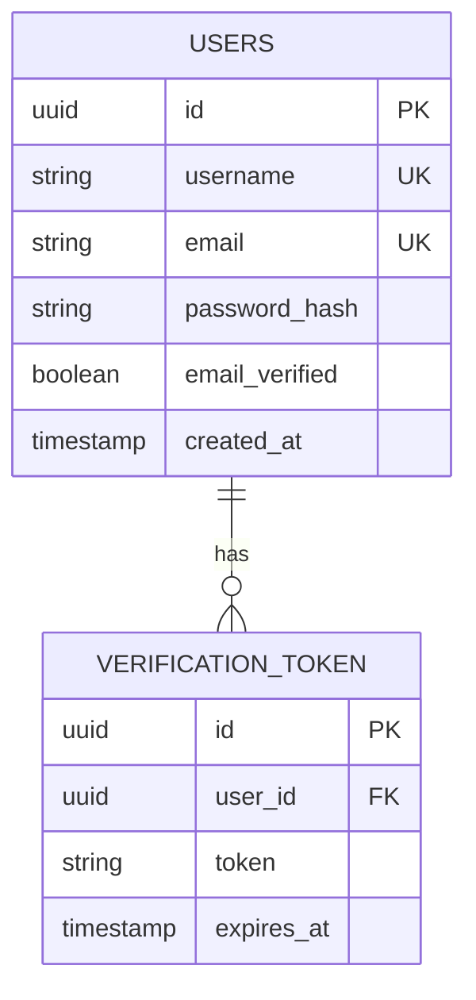

# Implementation Plan: User Registration

**Branch**: `[001-user-registration]` | **Date**: 2026-04-26 | **Spec**: [spec.md](spec.md)
**Input**: Feature specification from `/specs/001-user-registration/spec.md`

## Summary

Add user registration endpoint to the budget backend service. New users can register with username, email, and password. Email verification required before login. Existing Go/PostgreSQL stack.

## Technical Context

**Language/Version**: Go 1.23  
**Primary Dependencies**: chi/v5, pgx/v5, golang-jwt/jwt/v5, go-chi/httprate  
**Storage**: PostgreSQL (existing)  
**Testing**: Go's standard `testing` package  
**Target Platform**: Linux server  
**Project Type**: REST API backend  
**Performance Goals**: <200ms response time  
**Constraints**: Rate limited 10 req/min per IP, 5 req/min per username  
**Scale/Scope**: Single server, supports multiple users

## Constitution Check

All gates pass:

1. **Code Quality**: Using chi router, follows Go idioms, existing code passes golangci-lint
2. **Data Integrity**: User data uses proper constraints, passwords hashed with bcrypt
3. **TDD**: Tests exist for auth service and repository
4. **API Design**: RESTful endpoints with consistent JSON responses
5. **Error Handling**: Errors wrapped with context, appropriate HTTP status codes
6. **Security**: JWT tokens, rate limiting, password hashing in place

## Project Structure

### Documentation (this feature)

```
specs/001-user-registration/
├── plan.md              # This file
├── research.md          # Phase 0 output
├── data-model.md        # Phase 1 output
├── quickstart.md        # Phase 1 output
├── contracts/           # Phase 1 output
└── tasks.md             # Phase 2 (via /speckit.tasks)
```

### Source Code (repository root)

```
budget-be/
├── cmd/api/main.go           # Entry point (modify)
├── api/v1/auth/routes.go    # Existing routes (add register)
├── internal/
│   ├── auth/
│   │   ├── handler.go       # Existing handler (add register)
│   │   ├── service.go       # Existing service (add register logic)
│   │   └── middleware.go    # Existing middleware
│   ├── user/
│   │   ├── model.go        # Existing user model (add fields)
│   │   └── repository.go   # Existing repository (add create)
│   ├── loginattempt/        # Existing rate limiting
│   └── session/              # Existing sessions
├── migrations/
│   └── auth/
│       └── *.sql          # Add user columns
└── tests/
    └── *_test.go          # Add registration tests
```

**Structure Decision**: Single backend project extending existing auth module. New registration handler in existing `api/v1/auth/routes.go`, service logic in `internal/auth/service.go`.

## Complexity Tracking

> N/A - No violations

## API Impact

| Endpoint | Method | Change Type | Description |
|-----------|--------|-------------|-------------|
| `/api/v1/auth/register` | POST | New | User registration endpoint |
| `/api/v1/auth/verify` | POST | New | Email verification endpoint |

## Tables Impact

| Table | Change Type | Columns Affected | Description |
|-------|------------|-----------------|-------------|
| `users` | Modified | `email_verified`, `verification_token`, `verification_expires` | Email verification fields |
| `verification_tokens` | New | `user_id`, `token`, `expires_at` | Verification token storage |

## Diagrams

### Sequence Diagram



### Component Diagram

```mermaid
componentDiagram
    component Frontend {
      Registration Form
    }
    component API {
      Register Handler
      Auth Service
      Email Service
    }
    component Database {
      Users Table
      Verification Tokens
    }
    Frontend --> API
    API --> Database
```

### ERD (Database Changes)



## Research Required

- Email verification token expiration time (recommend 24 hours)
- Password requirements validation (8+ chars, 1+ number per spec)

## Next Steps

1. Phase 2: Generate tasks via `/speckit.tasks`
2. Implement registration endpoint
3. Add database migrations
4. Write tests first (TDD)
5. Implement email verification logic